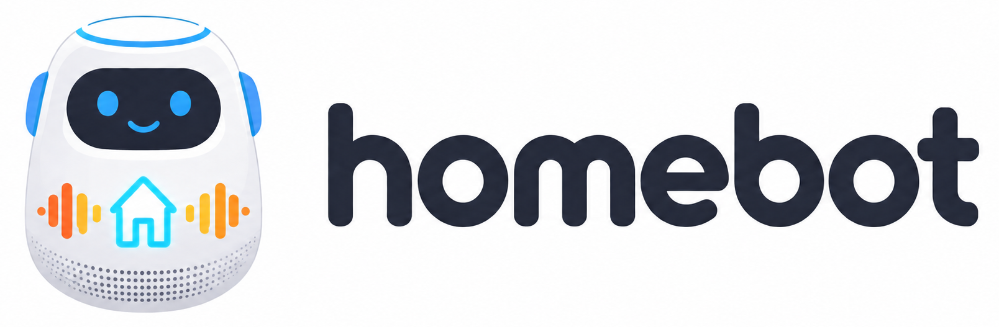

<p align="center">
  
</p>

<p align="center">
  
  
  <a href="https://ysyisyourbrother.github.io/homebot/"></a>
  <a href="https://github.com/ysyisyourbrother/homebot/issues"></a>
  <a href="https://github.com/ysyisyourbrother/homebot/pulls"></a>
  <a href="https://github.com/ysyisyourbrother/homebot/stargazers"></a>
  <a href="https://github.com/ysyisyourbrother/homebot/network/members"></a>
  <a href="https://deepwiki.com/ysyisyourbrother/homebot"></a>
</p>

Homebot is a locally deployable personal AI agent designed for practical home automation. It connects conversational AI with everyday household tools while keeping the system lightweight, extensible, and easy to customize.

## Features

- **Natural voice interaction** with custom wake words, speaker verification, streaming speech recognition, and text-to-speech.
- **Multi-channel conversations** through Feishu, Telegram, and local voice input. Multiple channels can run in parallel with one shared Agent.
- **Flexible model providers** with support for OpenAI-compatible services, including DeepSeek, OpenRouter, Qwen, and Zhipu.
- **Smart-home skills** for tasks such as controlling Xiaomi Mi Home devices, playing music, checking weather, and searching Xiaohongshu.
- **Local-first deployment** that can run on an existing computer with a clear, modular architecture for personal customization.
- **Extensible tools and skills** for adding new integrations without changing the core conversation flow.

## Quick Start

Requirements: Python 3.11 or later.

### 1. Clone the repository

```bash
git clone https://github.com/ysyisyourbrother/homebot.git
cd homebot
```

Downloads the source code and switches to the project directory.

### 2. Install Homebot

```bash
pip install -e .
```

Installs Homebot and its dependencies in editable mode, so local source changes are available immediately.

### 3. Initialize the configuration

```bash
python -m homebot init
```

Starts the setup wizard for the model provider, API keys, and optional voice services. The default configuration is stored at `~/.homebot/config.json`.

### 4. Start the gateway

```bash
python -m homebot gateway
```

Starts the gateway and all enabled channels. By default, it listens on `127.0.0.1:18790`.

Check the gateway health if needed:

```bash
curl http://127.0.0.1:18790/health
```

See the [documentation](docs/guide/quick-start.md) for channel configuration, tools, and skills.

## Contact

Homebot is an open-source project under active development. Its goal is to build a simple, practical, and genuinely deployable solution for the smart-home domain.

For questions, ideas, or contribution proposals, contact [brandonye@foxmail.com](mailto:brandonye@foxmail.com).

## Contributors

Thanks to everyone who has contributed to Homebot.

<a href="https://github.com/ysyisyourbrother/homebot/graphs/contributors">
  
</a>
