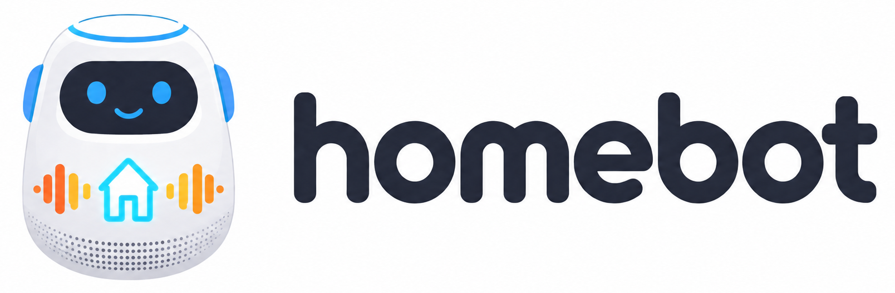

<p align="center">
  
</p>

<p align="center">
  📄 Technical Report: <a href="https://arxiv.org/pdf/2608.02254">Homebot: A Personal AI Agent for Conversational Home Assistance and Automation</a>
</p>

<p align="center">
  
  
  <a href="https://ysyisyourbrother.github.io/homebot/"></a>
  <a href="https://github.com/ysyisyourbrother/homebot/issues"></a>
  <a href="https://github.com/ysyisyourbrother/homebot/pulls"></a>
  <a href="https://github.com/ysyisyourbrother/homebot/stargazers"></a>
  <a href="https://github.com/ysyisyourbrother/homebot/network/members"></a>
  <a href="https://deepwiki.com/ysyisyourbrother/homebot"></a>
</p>

Homebot is a locally deployable personal AI agent designed for practical home automation. It connects conversational AI with everyday household tools while keeping the system lightweight, extensible, and easy to customize.

## Features

- **Natural voice interaction** with custom wake words, speaker verification, streaming speech recognition, and text-to-speech.
- **Multi-channel conversations** through Feishu, Telegram, and local voice input. Multiple channels can run in parallel with one shared Agent.
- **Flexible model providers** with support for OpenAI-compatible services, including DeepSeek, OpenRouter, Qwen, and Zhipu.
- **Smart-home skills** for tasks such as controlling Xiaomi Mi Home devices, playing music, checking weather, and searching Xiaohongshu.
- **Local-first deployment** that can run on an existing computer with a clear, modular architecture for personal customization.
- **Extensible tools and skills** for adding new integrations without changing the core conversation flow.

## Documentation

Installation, configuration, channels, tools and skills are documented at
**[ysyisyourbrother.github.io/homebot](https://ysyisyourbrother.github.io/homebot/)**.

Homebot runs on Python 3.11 or later. The documentation covers each supported
platform, including how to keep it running in the background and how to point
the voice channel at a specific microphone and speaker. See also the rest of
this README for what Homebot is and what it can do.

## Contact

Homebot is an open-source project under active development. Its goal is to build a simple, practical, and genuinely deployable solution for the smart-home domain.

For questions, ideas, or contribution proposals, contact [brandonye@foxmail.com](mailto:brandonye@foxmail.com).

## Contributors

Thanks to everyone who has contributed to Homebot.

<a href="https://github.com/ysyisyourbrother/homebot/graphs/contributors">
  
</a>

## References & Acknowledgements

Homebot draws inspiration from the following open-source projects. We sincerely thank their authors and communities for making their work available.

- [nanobot](https://github.com/HKUDS/nanobot) — Homebot's early implementation was informed by nanobot's elegant agent design, which helped shape its initial direction.
- [OpenClaw](https://github.com/openclaw/openclaw)
- [sherpa-onnx](https://github.com/k2-fsa/sherpa-onnx)

## Citation

If you find Homebot useful in your research, please consider citing:

```bibtex
@article{ye2026homebot,
  title={Homebot: A Personal AI Agent for Conversational Home Assistance and Automation},
  author={Ye, Shengyuan and Zhang, Yixin and Liang, Han and Zeng, Liekang and Du, Jiangsu and Yuan, Mu},
  journal={arXiv preprint arXiv:2608.02254},
  year={2026}
}
```
